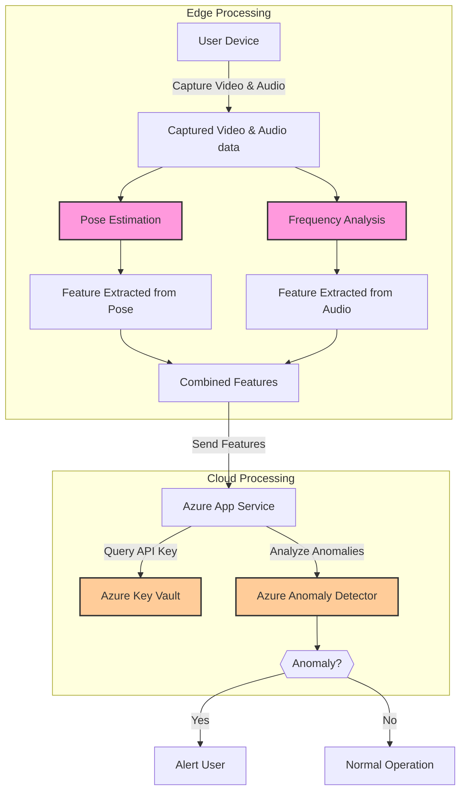

# Realtime Baby Monitor
This project is a real-time baby monitor that uses your device's camera and microphone to capture video and audio data. It analyzes the data in real-time to monitor the baby's movements and sounds, which are visualized in a series of charts. In case of any abnormal activity, the system will alert you.

## Demo
The demo below showcases the Real-time Baby Monitor in action. It demonstrates the system monitoring a baby using the index.html interface, running on an iPhone. The video captures the system's ability to detect anomalies, as indicated by the screen turning red upon detection of abnormal activity. This real-time response ensures that caregivers are promptly alerted to any potential concerns.

## How to Use
Before you start, make sure you have set up an Azure App Service, Azure Anomaly Detector, and Azure KeyVault.

1. Azure App Service: Follow [this guide](https://learn.microsoft.com/en-us/azure/app-service/) to set up Azure App Service.
1. Azure Anomaly Detector API: Follow [this guide](https://docs.microsoft.com/en-us/azure/cognitive-services/anomaly-detector/) to set up Azure Anomaly Detector.
1. Azure Key Vault: Follow [this guide](https://docs.microsoft.com/en-us/azure/key-vault/) to set up Azure Key Vault with the API Key of Azure Anomaly Detector.
1. Fork this repository to another repository
1. Modify the code regarding the parameters written in server.js  
1. Deploy the Azure app service with the repository
1. Access the end point URL of the deployed app service
1. Allow the web page to access your device's camera and microphone.
1. The system will start capturing video and audio data, analyzing it, and displaying the results in real time.

## Tested Environments
The Realtime Baby Monitor system has been tested and confirmed to work on the following environments:
- **Safari on iOS 16.5.1 / iPhone 14 Pro**: The system has been thoroughly tested on Safari browser running on iPhone 14 Pro, ensuring smooth operation and real-time monitoring capabilities.
- **Google Chrome on Windows 10**: The system has also been validated on Google Chrome browser operating on a Windows 10 platform, confirming its compatibility and functionality.

Please note that while the system has been optimized for these environments, it may also work on other platforms and browsers. However, for the best experience and full functionality, it is recommended to use the system on the tested environments mentioned above.

## Design Philosophy
The design of the Real-time Baby Monitor follows these principles:
- **Real-time Detection:** The system analyzes video and audio data in real-time to monitor the baby's movements and sounds, enabling immediate alerts in case of any abnormal activity
- **Immediate Deployment:** By leveraging Microsoft Azure's existing components, the system can be assembled in a modular fashion, ensuring high quality and accessibility for anyone. This allows users to quickly set up and start using the system
- **Adaptation:** By abstracting to KeyPoints and frequency power spectrum, the system becomes easily adaptable to different environments, enhancing its flexibility and adaptability
- **Minimized Data Transfer:** By analyzing the data and extracting features on the edge device, the amount of data transferred is minimized, saving bandwidth
- **Privacy by Design:** The system is designed to process data on the edge device (i.e., the user's PC), which means that sensitive video and audio data do not leave the user's device, ensuring privacy
- **Security:** The system uses Azure KeyVault to securely access APIs

## Architecture
The system is built using a client-server architecture. The client side is a web page that captures video and audio data using the user's camera and microphone. It processes the data to extract features and sends them to the server hosted in Azure App Service. The server side is an Azure App Service that receives the feature data, uses the Azure Anomaly Detector API to detect any anomalies incorporated with Azure Key Vault to establish the secure connection to these API, and sends the results back to the client. The client then visualizes the results and alerts the user if any anomalies are detected.

## Assumptions
The Real-time Baby Monitor operates under certain assumptions that must be considered for optimal performance:

- Camera Positioning: The camera must be fixed above the baby's bed and should not move during monitoring.
- Single Subject Monitoring: The system is designed to monitor a single baby, and it assumes that the baby is the only person in the camera's field of view.
- Environment Control: Optimal lighting and minimal background noise are assumed for accurate detection.
- Device Compatibility: The system assumes compatibility with the user's device for capturing video and audio data.
These assumptions guide the system's design and functionality, and deviations from these assumptions may affect the system's performance.

## Features
[See Features Details](markdown/feature_list.md)

## Limitations and Future Work
[See Limitations and Future Work Details](markdown/limitations_future_work.md)

## File Index
[See File Index Details](markdown/file_index.md)

## Software Used
This project uses the following software and libraries:
- **Azure App Service**: For hosting the web application.
- **Azure Anomaly Detector API**: For anomaly detection.
- **Azure KeyVault**: For securely managing secrets.
- **Chart.js**: For visualizing data.
- **Express**: Web application framework for Node.js.
- **Axios**: Promise-based HTTP client for the browser and Node.js.
- **TensorFlow.js PoseNet**: Real-time pose estimation in the browser.
- **Azure Identity Library**: For Azure SDK authentication.
- **Azure Key Vault Secrets Library**: For accessing Azure Key Vault secrets.

## Disclaimer

The Realtime Baby Monitor system is designed to assist caregivers in monitoring a subject, such as a baby, but it is not a substitute for human supervision. Users should be aware of the following risks and guidelines that may affect not only the monitored subject but also other individuals, animals, and property:

### Risks

- **Placement Risks**: Improper placement of devices directly above or near the monitored subject could cause injury to individuals, animals, or damage to property. Risks include falling or bouncing of devices, and hazards associated with cables, such as entanglement or suffocation.
- **Detection Risks**: The system may fail to detect all anomalies or abnormal activities, and regular human monitoring is essential.
- **Heat Risks**: Improper heat management during installation may lead to overheating of devices, which could result in insufficient setup or other issues. Prolonged exposure to heat from the devices may also pose health risks to individuals and may cause damage to property.
- **Electrical Risks**: Inadequate electrical safety measures may lead to electric shock or fire, affecting individuals, animals, or property.

### Safety Guidelines

- **Ensure Proper Placement**: Devices should be securely placed away from the monitored subject's reach and not directly above or near them. Avoid any placement that may lead to falling or bouncing of devices, causing injury or damage to property.
- **Maintain Regular Monitoring**: Do not solely rely on the system for monitoring. Regular human supervision is essential for safety.
- **Manage Heat Properly**: Ensure proper ventilation and heat management during installation to prevent overheating. Monitor the temperature of the devices regularly to prevent potential damage to property.
- **Follow Electrical Safety**: Adhere to standard electrical safety guidelines during installation and use. Avoid overloading outlets and ensure proper grounding.

By using this system, users acknowledge, accept these risks, and agree to follow the above safety guidelines. The creators and maintainers of the Realtime Baby Monitor project are not liable for any damages or injuries resulting from the improper use of the system.
